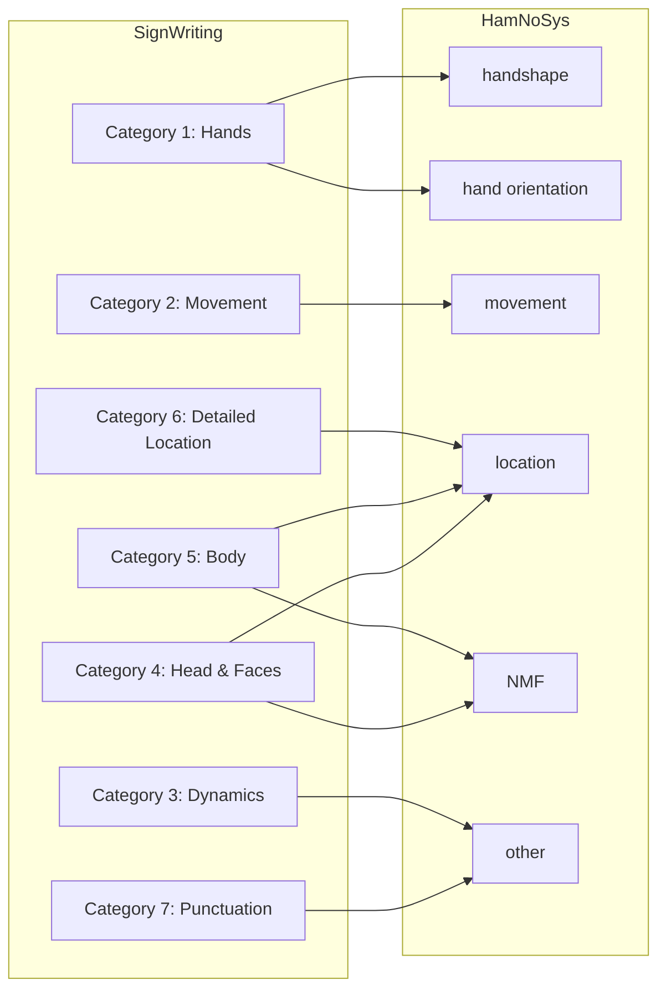

# HamNoSys

HamNoSys is another phonetic notation system for sign languages.

From Susanne Bentele at the university of Hamburg: https://www.signwriting.org/forums/linguistics/ling007.html
> The purpose of HamNoSys, unlike SignWriting, has never been an everyday use to 
> communicate (e.g. in letters) in sign language. 
> It was designed to fit a research setting and should be applicable to every sign language in the world.

To show multiple signs in both SignWriting and HamNoSys, you can look at:
https://www.signwriting.org/forums/linguistics/ling001.html
https://www.signwriting.org/forums/linguistics/ling002.html
https://www.signwriting.org/forums/linguistics/ling003.html

## Symbols

[`symbols.json`](symbols.json) lists every HamNoSys symbol: its official name (e.g. `hamfist`),
a human-readable title (e.g. `hamheadtop` is "Top of the head"),
Unicode codepoint (the font maps them into the Private Use Area, `U+E000`–`U+E0F1`),
the character itself, and the categories under which the official on-screen keyboard
([sign-lang.uni-hamburg.de/hamnosys/input](https://www.sign-lang.uni-hamburg.de/hamnosys/input/))
files it: Handshape, Orientation, Location, Movement 1, Movement 2, Two-handed.
Symbols that exist in the font but not on the keyboard (e.g. `hamversion40`, wrist movements)
have an empty category list.

[`HamNoSysUnicode.ttf`](HamNoSysUnicode.ttf) is the official font
(from [CTAN](https://ctan.org/pkg/hamnosys), also distributed by the University of Hamburg) —
needed to render HamNoSys strings.

## Handshapes

[`handshapes/`](handshapes) reconstructs the official HamNoSys 4 handshapes chart:
each hand drawing as a separate image, paired with its HamNoSys notation,
organized by handshape class. See [`handshapes/README.md`](handshapes/README.md).

## Resources

- [HamNoSys 4 Handshapes Chart](https://www.sign-lang.uni-hamburg.de/dgs-korpus/files/inhalt_pdf/HamNoSys_Handshapes.pdf) — the source of `handshapes/`
- [HamNoSys 2018 overview](https://www.sign-lang.uni-hamburg.de/dgs-korpus/files/inhalt_pdf/HamNoSys_2018.pdf) — concise, current reference
- [HamNoSys introduction guide](https://vhg.cmp.uea.ac.uk/tech/hamnosys/HNS-intro-guide.pdf) (UEA)
- [HamNoSys 4.1 syntax](https://vhg.cmp.uea.ac.uk/tech/hamnosys/HNS4.1.pdf) (UEA)
- [HamNoSys user guide draft](https://robertsmithresearch.wordpress.com/wp-content/uploads/2012/10/hamnosys-user-guide-rs-draft-v3-0.pdf) (Robert Smith)
- [CTAN font documentation](https://mirror.init7.net/ctan/fonts/hamnosys/hamnosys.pdf) — documents every glyph in the font
- [Official input keyboard](https://www.sign-lang.uni-hamburg.de/hamnosys/input/) — the source of symbol categories
- [hearai/parse-hamnosys](https://github.com/hearai/parse-hamnosys) — prior art on parsing HamNoSys strings

## Translation of HamNoSys to SignWriting

Around 2012, an effort from Sarah Ebling and Penny Boyes Braem was made to analyze HamNoSys and SignWriting.
In order to not lose their progress, we have organized and saved their work in this repository.
To our eyes, their attempt was to transcribe signs both in HamNoSys and SignWriting, and then compare the two,
using frequency analysis to find patterns and similarities.

Therefore, the parts of their work we are interested in keeping are:
- The general mapping between HamNoSys and SignWriting categories
- The parallel database of signs they have collected in HamNoSys and SignWriting

There is currently no translation "model" from HamNoSys to SignWriting, 
but with the help of the parallel database they have created, we can train a model to do so.

Our plan is:
1. **Rule-based translation** — map what maps cleanly (handshapes, locations, orientations)
   using the symbol inventory and category mapping above.
2. **Human post-editing** — give the rule-based output to annotators to fix.
3. **Learned translation** — train a model on the parallel database plus the corrected annotations.

### Category Mapping

```mermaid
flowchart LR
    subgraph SignWriting
        A[Category 1: Hands]
        B[Category 2: Movement]
        C[Category 3: Dynamics]
        D[Category 4: Head & Faces]
        E[Category 5: Body]
        F[Category 6: Detailed Location]
        G[Category 7: Punctuation]
    end
    
    subgraph HamNoSys
        H[handshape]
        I[hand orientation <palm orientation, extended finger direction>]
        K[movement]
        J[location]
        L[NMF <two-letter codes>]
        M[other]
    end
    
    A --> H & I
    B --> K
    D --> J & L
    E --> J & L
    F --> J
    G --> M
    C --> M
```

### Parallel Database

We store the database as a JSON file (`parallel.json`), combined from multiple files:
1. We extract glosses and links to signpuddle from `urls_glosses.txt`
2. We go over the `SW_signs_IDs` and convert each `layout.txt` file to FSW.
3. We go over `SW_signs_glosses` and convert each `layout.txt` file to FSW to match the gloss to the ID from `SW_signs_IDs`.
4. We add `HNS_alternative.txt` and `db_glossen_IDs_mit_HNS.txt`, match the ID or the gloss, and add the HamNoSys.