# SpeechWriting (Mundbildschrift)

Invented by: Stefan Wöhrmann

Mundbildschrift is a phonetic notation system designed to assist in the articulation training of deaf children.
It assigns specific symbols to different sounds of the German language.
The system focuses less on spelling accuracy and more on the association of graphemes with sound patterns to
facilitate the identification of specific mouth shapes.
This also helps in developing specialized word lists for educational purposes.

## Standards

- 2002: https://www.gebaerdenschrift.de/read/Mundbilder/uebersicht_mundbilder.htm
- 2010: https://www.signwriting.org/archive/docs7/sw0642_%DCbersicht_Symbole_der_Mundbildschrift_2010.pdf
- 2014: https://www.signwriting.org/symposium/archive/sws0002_05_Overview_of_Symbols_in_Mundbildschrift_Juli_2014.pdf

```bibtex
@inproceedings{2014SpellingRF,
  title={Spelling rules for Mundbilder in SignWriting documents},
  author={Stefan W{\o}hrmann},
  year={2014},
  url={https://www.signwriting.org/symposium/archive/sws0002_02_Mundbilder_in_SignWriting_and_Spelling_rules.pdf}
}
```


## Help Wanted!

Find anything wrong or missing? Please help improve this resource by submitting a PR or opening an issue!

- The `Grapheme`, `Example`, and `Description` columns were populated from the PDFs above without validation.
- The `Writing` column was populated by Amit, as close as possible to the standard, but is not always accurate.
- The `Instruction` column was generated by ChatGPT (`gpt-4o`), and may be inaccurate or incomplete.
  (Do you know of a formal IPA )

## Table

| IPA | SpeechWriting | SignWriting | Grapheme | Example | Description | Instruction | 
| --- | ------- | ------- | -------- | ------- | ----------- | ----------- | 
| ɑː | 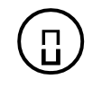 |  | a, aa, ah | Aal, Abend, Bahn | long „a” as in „bar” – or „calm” | Open your mouth wide, keep your tongue low and flat, and voice. |
| ʌ / a / æ | 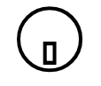 |  | a | Salz, Wand, Mann | short „u” as in Southern English „but” | Keep your tongue in the center of your mouth, slightly raised, with your mouth open and lips relaxed while voicing. |
| ɛː | 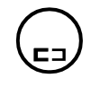 |  | ä, äh | Käse, spät, Nähmaschine, Fähre, Mähne | long as in „air“ | Raise the front of your tongue high in the mouth, spread your lips slightly, and voice. |
| ɛ / e | 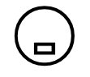 |  | e, ä | essen, Bett, Eltern, Äste | short „e” as in „bet” or „get“ | Place your tongue mid-high in the mouth, open your mouth slightly, and voice. |
| b | 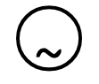 |  | b, bb | Boot, Ebbe, Banane, braun, aber | as in English „bed” | Press your lips together, build up pressure, then release while voicing. |
| ç | 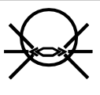 |  | ch – nach e, i, ä, ö, ü, eu, äu, l,n,r, ei, „ig“ am Wortende | ich, Teich, euch, Elch, Männchen, echt, nächste, möchte, Storch | Imagine saying the English word „humor“ but breath with the tip of the tongue touching the back of the lower front teeth. | Raise the middle of your tongue close to the hard palate, and push air through without vibrating the vocal cords. |
| x | 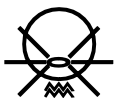 |  | ch nach „a“, „o“, „u“ und „au“ | acht, Tochter, Bauch, Buch, tauchen, Krach | Imagine the rasping guttural sound made in the back of your throat before you spit. | Raise the back of your tongue against the soft palate, and push air through without vibrating the vocal cords. |
| d | 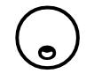 |  | d, dd | Dose, Paddel, das, dumm | same as its English equivalent „d” | Place the tip of your tongue against the ridge behind your upper front teeth, build up pressure, then release while voicing. |
| d͡ʒ / ʤ | 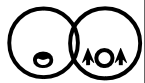 |  | Dsch | Dschungel | judge | Place the tip of your tongue against the ridge behind your upper front teeth, then release it while simultaneously voicing and passing air through a narrow gap. |
| eː | 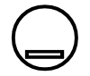 |  | e, ee, eh | Esel, Schnee, Mehl | long „e” similar to „a” in Northern English „gate” | Raise the front of your tongue close to the roof of your mouth, keep your lips unrounded, and voice. |
| ə | 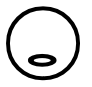 |  | e | Silbe, Hilfe, eine, kostet, Nadel, Nagel | like the final syllable of the English word „brother” | Keep your tongue in the middle of your mouth, mouth slightly open, and lips relaxed while voicing. |
| f | 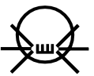 |  | f, ff, v | Fisch, Affe, fragen, Vater, voll, frisch | as „f“ in „fun“ | Press your bottom lip against your upper teeth, and push air through without vibrating the vocal cords. |
| ɡ | 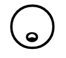 |  | g, gg | gut, Gras, Gurke, Bagger | like the „g“ in the English word „good“ or „go“ | Raise the back of your tongue against the soft palate, build up pressure, then release while voicing. |
| ʒ |  |  | g, j | Garage, Jalousie | like „sh“ but with voice | Raise the front of your tongue close to the roof of your mouth, round your lips slightly, and voice. |
| h | 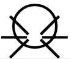 |  | H, h | Haus, Hund,hallo, heute | house, he, hat | Push air from your lungs through your open vocal tract without vibrating the vocal cords. |
| iː |  |  | i, ie, ih, ieh | Igel, Tier, ihm, Vieh | long „ee” as in „bee” or „teeth” | Raise the front of your tongue high and close to the roof of your mouth, keep your lips unrounded, and voice. |
| ɪ / i | 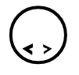 |  | i | ich, Milch, wichtig | short „i“ as in „fit”; never as in „bite” | Raise the front of your tongue high in the mouth, but not as high as for /iː/, keep your lips unrounded, and voice. |
| j | 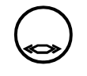 |  | j, y | Junge, ja, Jo – Jo, Yacht | like the „y“ in the English word „yes” | Raise the middle of your tongue close to the roof of your mouth, keep your lips unrounded, and voice. |
| k | 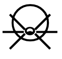 |  | k, ck, kk, c, ch, g | Kind, Zucker, Mokka, Clown, Chaos, Flug, krank, dick, trinken | like the „k“ in English | Raise the back of your tongue against the soft palate, build up pressure, then release without voicing. |
| l | 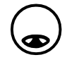 |  | l, ll | Lampe, Ball, lesen, leise, alt | like „l” in „little” | Place the tip of your tongue against the ridge behind your upper front teeth, and voice. |
| m | 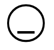 |  | m, mm | Mutter, Maus, Hammer, Nummer, machen | like „m“ as in English „mother“ | Press your lips together, let the air pass through your nose, and voice. |
| n | 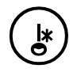 |  | n, nn | Name, Nase, Hand, Tante, rennen, Kanne, Susanne, nie | like „n“ in „no“ or „name“ | Place the tip of your tongue against the ridge behind your upper front teeth, let the air pass through your nose, and voice. |
| ŋ | 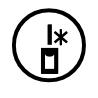 |  | n, ng, nk | Ring, Zange, Junge, Bon, krank, trinken | like the „ng“ sound in the English word „song“ or „long” | Raise the back of your tongue against the soft palate, let the air pass through your nose, and voice. |
| oː / o / ɑ | 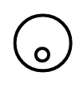 |  | o, oo, oh | Ofen, Oma, Kohle, Zoo, Krone, groß, Obst | long „o” similar to „go” but with the lips more rounded and more open | Raise the back of your tongue close to the roof of your mouth, round your lips, and voice. |
| ɔ | 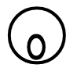 |  | o | Onkel, offen, Kopf | short „o” as in „stop” or „not” | Lower the back of your tongue, open your mouth, and round your lips slightly while voicing. |
| øː | 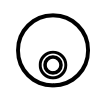 |  | ö, öh | König, Löwe, blöd, Öl | similar to „eu” in French „peu”; long, say a long e and purse your lips | Raise the front of your tongue high in the mouth, round your lips tightly, and voice. |
| œ | 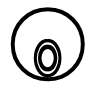 |  | ö | Öffnung, östlich | short, cross between „i” in „dirt” and „eu” in French „peu” | Raise the front of your tongue mid-high in the mouth, round your lips moderately, and voice. |
| ɔː | 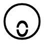 |  |  |  | call, four, saw | Lower the back of your tongue, open your mouth wide, and round your lips while voicing. |
| p | 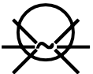 |  | p (b - am Silbenende, oder vor s oder vor t ) | Papa, Puppe, pusten, ab, Obst, Bobtail | like „p“ in „Paula“ | Press your lips together, build up pressure, then release without voicing. |
| p͡f | 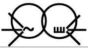 |  | pf | Pfanne, Pfeffer, Pfau | like „pf“ in „upfront“ | Press your lips together, build up pressure, then release while simultaneously bringing your bottom lip close to your upper teeth, and push air through. |
| r | 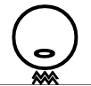 |  | r, rr, rh | Raupe, Karre, Rhabarber, rudern, rot | „rrr” as if the speaker were gargling (there is another „r” produced with the tip of the tongue) | Raise the back of your tongue close to the soft palate and make it vibrate while voicing. |
| ɹ | 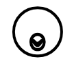 |  | r | run, red, car | like the „r” in „run” or „red” | Raise the tip of your tongue close to the ridge behind your upper front teeth without touching, keep your lips slightly rounded, and voice. |
| z | 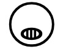 |  | s | Saft, Rasen, Riese, Rose | like an English „z” | Place the tip of your tongue close to the ridge behind your upper front teeth, and push air through while voicing. |
| s | 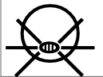 |  | s, ss, ß, c | Glas, Klasse, groß, City, Bus, muss, Wasser | like an English „s” | Place the tip of your tongue close to the ridge behind your upper front teeth, and push air through without voicing. |
| ʃ | 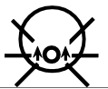 |  | sch s(t), s(p), sh, ch | Schule, Stein, Spinne, Shampoo, Chance | like the „sh” at the beginning of „show” or „short” | Raise the front of your tongue close to the roof of your mouth, round your lips, and push air through without voicing. |
| ð | 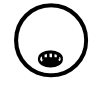 |  | th | the, mother, father, with | like the „th” in „this” or „mother” | Place the tip of your tongue between your upper and lower teeth, and push air through while voicing. |
| θ | 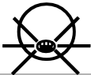 |  | th | three, youth, club, month | like the „th” in „think” or „both” | Place the tip of your tongue between your upper and lower teeth, and push air through without voicing. |
| t | 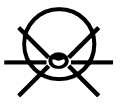 |  | t, tt, th, dt, d | Tasse, Ratte, Theater, Stadt, Wand, Hund, turnen, tot, traurig | same as in English „Tom“ | Place the tip of your tongue against the ridge behind your upper front teeth, build up pressure, then release without voicing. |
| tʃ / ʧ | 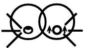 |  | tsch, ch | klatschen, Tschüs,knutschen | like „ch” in „church” | Place the tip of your tongue against the ridge behind your upper front teeth, then release it while simultaneously pushing air through a narrow gap. |
| uː / w | 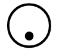 |  | u, uh | Buch, Tube, Huhn, Stuhl | long „oo” as in „boot” with the lips much more rounded | Raise the back of your tongue high in the mouth, round your lips tightly, and voice. |
| ʊ / u | 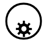 |  | u | Hund, Stunde, Unfall | short „o“ like in „foot” or „push” | Raise the back of your tongue high in the mouth, round your lips moderately, and voice. |
| yː | 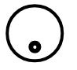 |  | ü, üh, y | Gefühl, Kühltruhe, üben, Mühe, Mühle | try to say a long German „ie“ sound and then purse your lips | Raise the front of your tongue high in the mouth, round your lips tightly, and voice. |
| y | 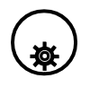 |  | ü | Glück, zurück, Küste, dünn, Mücke | short, like „u“ in French „une“ or English „dune“, but with lips pressed much closer together | Raise the front of your tongue high in the mouth, round your lips tightly, and voice. |
| v | 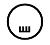 |  | w, v | Wand, Wüste, wohnen, abwaschen, weit, Vase | like „v“ in „very“, not English „w“ | Press your bottom lip against your upper teeth, and push air through while voicing. |
| ks | 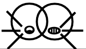 |  | x, ks, gs, chs, cks | Wachs, Taxi, Ochse, werktags, Luchs, Text, Knacks | like the „x“ in the English word „oxen“ as a „ks” sound | Make a /k/ sound followed immediately by an /s/ sound. |
| t͡s | 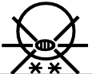 |  | z, tz, zz, ts, ds | Zahn, Katze, Pizza, Rätsel, Schiedsrichter | like the „ts“ sound in the English words „lots” and „cats” (tsetse) | Place the tip of your tongue against the ridge behind your upper front teeth, then release it while simultaneously pushing air through a narrow gap. |
| a͡ʊ | 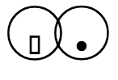 |  | au, ao | Auto, Stau, laut, Haus, Kakao | „ow” as in English „cow” but in a more brief and clipped manner | Start with your tongue low and your mouth open, then move your tongue upward and close your lips into a rounded shape while voicing. |
| ɔ͡ø | 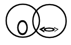 |  | äu, eu, oi | Feuer, Eule, Gebäude, aufräumen, Konvoi | „oy“ as in English „toy“ | Start with your tongue low and your lips rounded, then move your tongue upward and forward while rounding your lips tighter. |
| a͡ɪ | 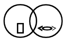 |  | ei, ai, ay, ey, eih | Hai, Eimer, leise, Meyer, Reihe, Karl May | English „i“ as in „high“ or „mine” | Start with your tongue low and your mouth open, then move your tongue upward and close your lips into a slight smile while voicing. |
